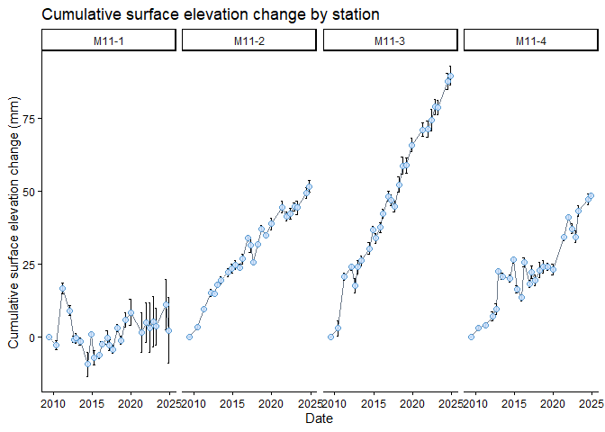
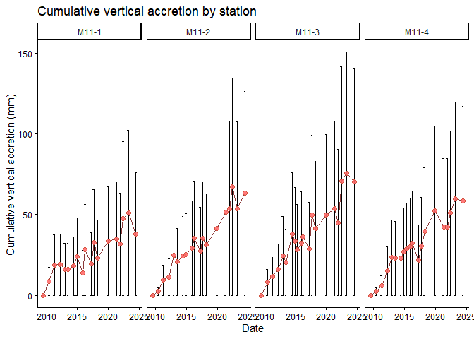
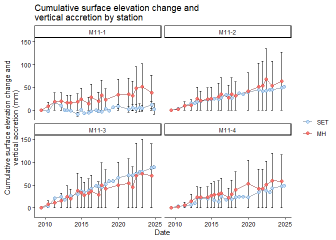

<!-- README.md is generated from README.Rmd. Please edit that file -->

# NPSETr

The goal of NPSETr is to simplify the calculation of cumulative rates of
surface elevation change and vertical accretion from the National Park
Services’ Surface Elevation Table (SET) data.

This package is based on the [SETr](https://github.com/swmpkim/SETr)
package developed by Kim Cressman for the National Estuarine Research
Reserve System
(<https://nerrssciencecollaborative.org/project/Cressman18>).

## Installation

You can install NPSETr from [GitHub](https://github.com/) with:

``` r
# Set download options and install prerequisite packages
options(download.file.method = "wininet")
install.packages(c("languageserver", "jsonlite", "rlang", "devtools", "remotes", "broom.mixed", "tidyverse"))

# Install NPSutils from github and upgrade all dependencies
devtools::install_github("nationalparkservice/NPSutils", upgrade='always')

# then install NPSETr
devtools::install_github("laura-feher/NPSETr")
```

## Primary Functions

- [Load SET or MH data](#load-set-or-mh-data)
  - [From the most recent NPS I&M SET data
    package](#from-the-most-recent-nps-im-set-data-package)
  - [From the NPS I&M SET database](#from-the-nps-im-set-database)
  - [From a saved file of raw SET or MH
    data](#from-a-saved-file-of-raw-set-or-mh-data)
- [Calculate cumulative change](#calculate-cumulative-change)
- [Plot cumulative change](#plot-cumulative-change)
- [Calculate linear rates of change](#calculate-linear-rates-of-change)
- [Plot and compare rates of change](#plot-and-compare-rates-of-change)
- [Get park-specific SLR data &
  rates](#get-park-specific-slr-data-and-rates)
- [Save SET/MH data, cumulative change, or rates of change to
  file](#save-setmh-data-cumulative-change-or-rates-of-change-to-file)
- [Save SLR data & rates to file](#save-slr-data-rates-to-file)

## Load SET or MH data

The package provides 3 options for downloading SET-MH data and loading
it into R:

### From the most recent NPS I&M SET data package

Most users from within NPS will want to get data from the most recent
version of the NPS I&M SET data package on DataStore. Use
`load_set_data()` to get raw surface elevation table data or
`load_mh_data()` to get raw marker horizon data. Use the network code
(`network_code`) or park code (`park`) arguments to filter the data to a
specific I&M network(s) or park(s) using the appropriate 4-letter code.

``` r
library(NPSETr)

# The `load_` functions utilize the `get_data_package` function from the NPSutils package

set_df <- NPSETr::load_set_data(park = "ASIS")
#> Working on: 2316550.
#> The directory C:/Users/lfeher/OneDrive - DOI/NPSETr/data/2316550 already exists.
#> Write over the existing directory and its contents?
#> 
#> 1: Yes
#> 2: No
#> 1: Yes
#> 2: No
#> 
#>   |                                                                              |                                                                      |   0%  |                                                                              |=                                                                     |   1%  |                                                                              |==                                                                    |   3%  |                                                                              |====                                                                  |   6%  |                                                                              |======                                                                |   9%  |                                                                              |=======                                                               |   9%  |                                                                              |========                                                              |  11%  |                                                                              |==========                                                            |  14%  |                                                                              |=============                                                         |  19%  |                                                                              |===============                                                       |  21%  |                                                                              |===================                                                   |  27%  |                                                                              |====================                                                  |  29%  |                                                                              |======================                                                |  32%  |                                                                              |==========================                                            |  37%  |                                                                              |===========================                                           |  38%  |                                                                              |===========================                                           |  39%  |                                                                              |=============================                                         |  42%  |                                                                              |==============================                                        |  43%  |                                                                              |===============================                                       |  44%  |                                                                              |================================                                      |  45%  |                                                                              |==================================                                    |  49%  |                                                                              |====================================                                  |  52%  |                                                                              |============================================                          |  63%  |                                                                              |==============================================                        |  65%  |                                                                              |==================================================                    |  71%  |                                                                              |==================================================                    |  72%  |                                                                              |===================================================                   |  73%  |                                                                              |=======================================================               |  78%  |                                                                              |========================================================              |  80%  |                                                                              |==============================================================        |  88%  |                                                                              |===============================================================       |  90%  |                                                                              |================================================================      |  91%  |                                                                              |=================================================================     |  92%  |                                                                              |======================================================================| 100%
#> Writing: C:/Users/lfeher/OneDrive - DOI/NPSETr/data/2316550/critical_information_data_20260128.csv.
#>   |                                                                              |                                                                      |   0%  |                                                                              |=                                                                     |   1%  |                                                                              |=======                                                               |  10%  |                                                                              |=========                                                             |  12%  |                                                                              |=============                                                         |  18%  |                                                                              |===============                                                       |  21%  |                                                                              |===================                                                   |  27%  |                                                                              |=====================                                                 |  30%  |                                                                              |======================                                                |  31%  |                                                                              |=======================                                               |  32%  |                                                                              |================================                                      |  46%  |                                                                              |=====================================                                 |  53%  |                                                                              |======================================                                |  54%  |                                                                              |======================================                                |  55%  |                                                                              |=======================================                               |  56%  |                                                                              |=========================================                             |  59%  |                                                                              |==========================================                            |  59%  |                                                                              |=============================================                         |  65%  |                                                                              |==============================================                        |  66%  |                                                                              |===============================================                       |  68%  |                                                                              |================================================                      |  69%  |                                                                              |=================================================                     |  70%  |                                                                              |====================================================                  |  74%  |                                                                              |========================================================              |  80%  |                                                                              |==========================================================            |  82%  |                                                                              |============================================================          |  86%  |                                                                              |===============================================================       |  90%  |                                                                              |======================================================================| 100%
#> Writing: C:/Users/lfeher/OneDrive - DOI/NPSETr/data/2316550/event_data_20260128.csv.
#>   |                                                                              |                                                                      |   0%  |                                                                              |=                                                                     |   1%  |                                                                              |=                                                                     |   2%  |                                                                              |==                                                                    |   2%  |                                                                              |==                                                                    |   3%  |                                                                              |===                                                                   |   4%  |                                                                              |===                                                                   |   5%  |                                                                              |====                                                                  |   5%  |                                                                              |====                                                                  |   6%  |                                                                              |=====                                                                 |   7%  |                                                                              |======                                                                |   8%  |                                                                              |======                                                                |   9%  |                                                                              |=======                                                               |  10%  |                                                                              |========                                                              |  11%  |                                                                              |=========                                                             |  12%  |                                                                              |=========                                                             |  13%  |                                                                              |==========                                                            |  14%  |                                                                              |===========                                                           |  16%  |                                                                              |============                                                          |  17%  |                                                                              |=============                                                         |  19%  |                                                                              |==============                                                        |  19%  |                                                                              |===============                                                       |  21%  |                                                                              |================                                                      |  22%  |                                                                              |================                                                      |  23%  |                                                                              |=================                                                     |  24%  |                                                                              |=================                                                     |  25%  |                                                                              |==================                                                    |  25%  |                                                                              |==================                                                    |  26%  |                                                                              |===================                                                   |  27%  |                                                                              |===================                                                   |  28%  |                                                                              |=====================                                                 |  30%  |                                                                              |======================                                                |  31%  |                                                                              |======================                                                |  32%  |                                                                              |=======================                                               |  33%  |                                                                              |========================                                              |  34%  |                                                                              |========================                                              |  35%  |                                                                              |=========================                                             |  35%  |                                                                              |=========================                                             |  36%  |                                                                              |==========================                                            |  37%  |                                                                              |==========================                                            |  38%  |                                                                              |===========================                                           |  38%  |                                                                              |===========================                                           |  39%  |                                                                              |=============================                                         |  41%  |                                                                              |=============================                                         |  42%  |                                                                              |==============================                                        |  43%  |                                                                              |==============================                                        |  44%  |                                                                              |===============================                                       |  44%  |                                                                              |===============================                                       |  45%  |                                                                              |================================                                      |  45%  |                                                                              |================================                                      |  46%  |                                                                              |=================================                                     |  47%  |                                                                              |==================================                                    |  48%  |                                                                              |==================================                                    |  49%  |                                                                              |===================================                                   |  50%  |                                                                              |===================================                                   |  51%  |                                                                              |====================================                                  |  51%  |                                                                              |====================================                                  |  52%  |                                                                              |=====================================                                 |  52%  |                                                                              |=====================================                                 |  53%  |                                                                              |======================================                                |  54%  |                                                                              |======================================                                |  55%  |                                                                              |=======================================                               |  56%  |                                                                              |========================================                              |  56%  |                                                                              |========================================                              |  57%  |                                                                              |=========================================                             |  59%  |                                                                              |==========================================                            |  60%  |                                                                              |==========================================                            |  61%  |                                                                              |===========================================                           |  62%  |                                                                              |============================================                          |  63%  |                                                                              |=============================================                         |  64%  |                                                                              |=============================================                         |  65%  |                                                                              |==============================================                        |  65%  |                                                                              |==============================================                        |  66%  |                                                                              |===============================================                       |  66%  |                                                                              |===============================================                       |  67%  |                                                                              |===============================================                       |  68%  |                                                                              |================================================                      |  68%  |                                                                              |================================================                      |  69%  |                                                                              |=================================================                     |  69%  |                                                                              |=================================================                     |  70%  |                                                                              |==================================================                    |  71%  |                                                                              |==================================================                    |  72%  |                                                                              |===================================================                   |  72%  |                                                                              |===================================================                   |  73%  |                                                                              |====================================================                  |  74%  |                                                                              |====================================================                  |  75%  |                                                                              |=====================================================                 |  75%  |                                                                              |=====================================================                 |  76%  |                                                                              |======================================================                |  77%  |                                                                              |======================================================                |  78%  |                                                                              |=======================================================               |  78%  |                                                                              |=======================================================               |  79%  |                                                                              |========================================================              |  79%  |                                                                              |========================================================              |  80%  |                                                                              |=========================================================             |  81%  |                                                                              |=========================================================             |  82%  |                                                                              |==========================================================            |  82%  |                                                                              |==========================================================            |  83%  |                                                                              |===========================================================           |  84%  |                                                                              |===========================================================           |  85%  |                                                                              |============================================================          |  85%  |                                                                              |============================================================          |  86%  |                                                                              |=============================================================         |  87%  |                                                                              |==============================================================        |  88%  |                                                                              |==============================================================        |  89%  |                                                                              |===============================================================       |  89%  |                                                                              |===============================================================       |  90%  |                                                                              |===============================================================       |  91%  |                                                                              |================================================================      |  91%  |                                                                              |================================================================      |  92%  |                                                                              |=================================================================     |  92%  |                                                                              |=================================================================     |  93%  |                                                                              |=================================================================     |  94%  |                                                                              |==================================================================    |  94%  |                                                                              |==================================================================    |  95%  |                                                                              |===================================================================   |  95%  |                                                                              |===================================================================   |  96%  |                                                                              |====================================================================  |  97%  |                                                                              |====================================================================  |  98%  |                                                                              |===================================================================== |  98%  |                                                                              |======================================================================|  99%  |                                                                              |======================================================================| 100%
#> Writing: C:/Users/lfeher/OneDrive - DOI/NPSETr/data/2316550/marker_horizon_data_20260128.csv.
#>   |                                                                              |                                                                      |   0%  |                                                                              |                                                                      |   1%  |                                                                              |=                                                                     |   1%  |                                                                              |=                                                                     |   2%  |                                                                              |==                                                                    |   2%  |                                                                              |==                                                                    |   3%  |                                                                              |===                                                                   |   4%  |                                                                              |===                                                                   |   5%  |                                                                              |====                                                                  |   5%  |                                                                              |====                                                                  |   6%  |                                                                              |=====                                                                 |   6%  |                                                                              |=====                                                                 |   7%  |                                                                              |=====                                                                 |   8%  |                                                                              |======                                                                |   8%  |                                                                              |======                                                                |   9%  |                                                                              |=======                                                               |   9%  |                                                                              |=======                                                               |  10%  |                                                                              |=======                                                               |  11%  |                                                                              |========                                                              |  11%  |                                                                              |========                                                              |  12%  |                                                                              |=========                                                             |  12%  |                                                                              |=========                                                             |  13%  |                                                                              |=========                                                             |  14%  |                                                                              |==========                                                            |  14%  |                                                                              |==========                                                            |  15%  |                                                                              |===========                                                           |  15%  |                                                                              |===========                                                           |  16%  |                                                                              |============                                                          |  16%  |                                                                              |============                                                          |  17%  |                                                                              |============                                                          |  18%  |                                                                              |=============                                                         |  18%  |                                                                              |=============                                                         |  19%  |                                                                              |==============                                                        |  19%  |                                                                              |==============                                                        |  20%  |                                                                              |==============                                                        |  21%  |                                                                              |===============                                                       |  21%  |                                                                              |===============                                                       |  22%  |                                                                              |================                                                      |  22%  |                                                                              |================                                                      |  23%  |                                                                              |================                                                      |  24%  |                                                                              |=================                                                     |  24%  |                                                                              |=================                                                     |  25%  |                                                                              |==================                                                    |  25%  |                                                                              |==================                                                    |  26%  |                                                                              |===================                                                   |  27%  |                                                                              |===================                                                   |  28%  |                                                                              |====================                                                  |  28%  |                                                                              |====================                                                  |  29%  |                                                                              |=====================                                                 |  29%  |                                                                              |=====================                                                 |  30%  |                                                                              |=====================                                                 |  31%  |                                                                              |======================                                                |  31%  |                                                                              |======================                                                |  32%  |                                                                              |=======================                                               |  32%  |                                                                              |=======================                                               |  33%  |                                                                              |=======================                                               |  34%  |                                                                              |========================                                              |  34%  |                                                                              |========================                                              |  35%  |                                                                              |=========================                                             |  35%  |                                                                              |=========================                                             |  36%  |                                                                              |==========================                                            |  37%  |                                                                              |==========================                                            |  38%  |                                                                              |===========================                                           |  38%  |                                                                              |===========================                                           |  39%  |                                                                              |============================                                          |  39%  |                                                                              |============================                                          |  40%  |                                                                              |============================                                          |  41%  |                                                                              |=============================                                         |  41%  |                                                                              |=============================                                         |  42%  |                                                                              |==============================                                        |  42%  |                                                                              |==============================                                        |  43%  |                                                                              |==============================                                        |  44%  |                                                                              |===============================                                       |  44%  |                                                                              |===============================                                       |  45%  |                                                                              |================================                                      |  45%  |                                                                              |================================                                      |  46%  |                                                                              |=================================                                     |  46%  |                                                                              |=================================                                     |  47%  |                                                                              |=================================                                     |  48%  |                                                                              |==================================                                    |  48%  |                                                                              |==================================                                    |  49%  |                                                                              |===================================                                   |  49%  |                                                                              |===================================                                   |  50%  |                                                                              |===================================                                   |  51%  |                                                                              |====================================                                  |  51%  |                                                                              |====================================                                  |  52%  |                                                                              |=====================================                                 |  52%  |                                                                              |=====================================                                 |  53%  |                                                                              |======================================                                |  54%  |                                                                              |======================================                                |  55%  |                                                                              |=======================================                               |  55%  |                                                                              |=======================================                               |  56%  |                                                                              |========================================                              |  56%  |                                                                              |========================================                              |  57%  |                                                                              |========================================                              |  58%  |                                                                              |=========================================                             |  58%  |                                                                              |=========================================                             |  59%  |                                                                              |==========================================                            |  59%  |                                                                              |==========================================                            |  60%  |                                                                              |==========================================                            |  61%  |                                                                              |===========================================                           |  61%  |                                                                              |===========================================                           |  62%  |                                                                              |============================================                          |  62%  |                                                                              |============================================                          |  63%  |                                                                              |============================================                          |  64%  |                                                                              |=============================================                         |  64%  |                                                                              |=============================================                         |  65%  |                                                                              |==============================================                        |  65%  |                                                                              |==============================================                        |  66%  |                                                                              |===============================================                       |  66%  |                                                                              |===============================================                       |  67%  |                                                                              |===============================================                       |  68%  |                                                                              |================================================                      |  68%  |                                                                              |================================================                      |  69%  |                                                                              |=================================================                     |  69%  |                                                                              |=================================================                     |  70%  |                                                                              |=================================================                     |  71%  |                                                                              |==================================================                    |  71%  |                                                                              |==================================================                    |  72%  |                                                                              |===================================================                   |  72%  |                                                                              |===================================================                   |  73%  |                                                                              |===================================================                   |  74%  |                                                                              |====================================================                  |  74%  |                                                                              |====================================================                  |  75%  |                                                                              |=====================================================                 |  75%  |                                                                              |=====================================================                 |  76%  |                                                                              |======================================================                |  76%  |                                                                              |======================================================                |  77%  |                                                                              |======================================================                |  78%  |                                                                              |=======================================================               |  78%  |                                                                              |=======================================================               |  79%  |                                                                              |========================================================              |  79%  |                                                                              |========================================================              |  80%  |                                                                              |========================================================              |  81%  |                                                                              |=========================================================             |  81%  |                                                                              |=========================================================             |  82%  |                                                                              |==========================================================            |  82%  |                                                                              |==========================================================            |  83%  |                                                                              |==========================================================            |  84%  |                                                                              |===========================================================           |  84%  |                                                                              |===========================================================           |  85%  |                                                                              |============================================================          |  85%  |                                                                              |============================================================          |  86%  |                                                                              |=============================================================         |  86%  |                                                                              |=============================================================         |  87%  |                                                                              |=============================================================         |  88%  |                                                                              |==============================================================        |  88%  |                                                                              |==============================================================        |  89%  |                                                                              |===============================================================       |  89%  |                                                                              |===============================================================       |  90%  |                                                                              |===============================================================       |  91%  |                                                                              |================================================================      |  91%  |                                                                              |================================================================      |  92%  |                                                                              |=================================================================     |  92%  |                                                                              |=================================================================     |  93%  |                                                                              |=================================================================     |  94%  |                                                                              |==================================================================    |  94%  |                                                                              |==================================================================    |  95%  |                                                                              |===================================================================   |  95%  |                                                                              |===================================================================   |  96%  |                                                                              |====================================================================  |  96%  |                                                                              |====================================================================  |  97%  |                                                                              |====================================================================  |  98%  |                                                                              |===================================================================== |  98%  |                                                                              |===================================================================== |  99%  |                                                                              |======================================================================|  99%  |                                                                              |======================================================================| 100%
#> Writing: C:/Users/lfeher/OneDrive - DOI/NPSETr/data/2316550/pin_data_20260128.csv.
#>   |                                                                              |                                                                      |   0%  |                                                                              |===============                                                       |  22%  |                                                                              |======================================================================| 100%
#> Writing: C:/Users/lfeher/OneDrive - DOI/NPSETr/data/2316550/pin_group_data_20260128.csv.
#>   |                                                                              |                                                                      |   0%  |                                                                              |============                                                          |  17%  |                                                                              |=====================                                                 |  30%  |                                                                              |================================================                      |  69%  |                                                                              |===============================================================       |  91%  |                                                                              |==================================================================    |  95%  |                                                                              |======================================================================| 100%
#> Writing: C:/Users/lfeher/OneDrive - DOI/NPSETr/data/2316550/station_data_20260128.csv.
#>   |                                                                              |                                                                      |   0%  |                                                                              |                                                                      |   1%  |                                                                              |=                                                                     |   2%  |                                                                              |===                                                                   |   5%  |                                                                              |====                                                                  |   6%  |                                                                              |=====                                                                 |   7%  |                                                                              |==========                                                            |  14%  |                                                                              |============                                                          |  16%  |                                                                              |=============                                                         |  19%  |                                                                              |==============                                                        |  20%  |                                                                              |====================                                                  |  29%  |                                                                              |=====================                                                 |  29%  |                                                                              |========================                                              |  34%  |                                                                              |========================                                              |  35%  |                                                                              |=========================                                             |  36%  |                                                                              |===========================                                           |  38%  |                                                                              |============================                                          |  40%  |                                                                              |=============================                                         |  42%  |                                                                              |===============================                                       |  44%  |                                                                              |================================                                      |  46%  |                                                                              |==================================                                    |  49%  |                                                                              |===================================                                   |  49%  |                                                                              |=========================================                             |  58%  |                                                                              |=========================================                             |  59%  |                                                                              |==========================================                            |  59%  |                                                                              |============================================                          |  63%  |                                                                              |=============================================                         |  64%  |                                                                              |================================================                      |  69%  |                                                                              |===================================================                   |  73%  |                                                                              |====================================================                  |  74%  |                                                                              |=====================================================                 |  75%  |                                                                              |=====================================================                 |  76%  |                                                                              |======================================================                |  77%  |                                                                              |=======================================================               |  78%  |                                                                              |=======================================================               |  79%  |                                                                              |===========================================================           |  84%  |                                                                              |===============================================================       |  90%  |                                                                              |================================================================      |  92%  |                                                                              |===================================================================== |  98%  |                                                                              |======================================================================| 100%
#> Writing: C:/Users/lfeher/OneDrive - DOI/NPSETr/data/2316550/20260128_SET_metadata.xml.
#> Any downloaded data package(s) can be found at:

set_df %>%
    dplyr::select(
        network_code,
        park_code,
        site_name,
        station_code,
        event_date_UTC,
        SET_direction,
        pin_position,
        pin_height_mm
    ) %>%
    head()
#> # A tibble: 6 × 8
#>   network_code park_code site_name     station_code event_date_UTC SET_direction
#>   <chr>        <chr>     <chr>         <chr>        <date>         <chr>        
#> 1 NCBN         ASIS      Marsh 6 (Pin… M6-4         2016-03-28     D            
#> 2 NCBN         ASIS      Marsh 6 (Pin… M6-4         2016-03-28     D            
#> 3 NCBN         ASIS      Marsh 6 (Pin… M6-4         2016-03-28     D            
#> 4 NCBN         ASIS      Marsh 6 (Pin… M6-4         2016-03-28     D            
#> 5 NCBN         ASIS      Marsh 6 (Pin… M6-4         2016-03-28     D            
#> 6 NCBN         ASIS      Marsh 6 (Pin… M6-4         2016-03-28     D            
#> # ℹ 2 more variables: pin_position <dbl>, pin_height_mm <dbl>
```

You can also supply a list of multiple parks or networks:

``` r
set_df <- NPSETr::load_set_data(park = c("ASIS", "COLO"))
#> Working on: 2316550.
#> The directory C:/Users/lfeher/OneDrive - DOI/NPSETr/data/2316550 already exists.
#> Write over the existing directory and its contents?
#> 
#> 1: Yes
#> 2: No
#> 1: Yes
#> 2: No
#> 
#>   |                                                                              |                                                                      |   0%  |                                                                              |=                                                                     |   1%  |                                                                              |=                                                                     |   2%  |                                                                              |==                                                                    |   2%  |                                                                              |========                                                              |  11%  |                                                                              |==========                                                            |  14%  |                                                                              |==============                                                        |  20%  |                                                                              |=====================                                                 |  29%  |                                                                              |======================                                                |  32%  |                                                                              |=======================                                               |  33%  |                                                                              |=======================                                               |  34%  |                                                                              |========================                                              |  35%  |                                                                              |=============================                                         |  41%  |                                                                              |=====================================                                 |  53%  |                                                                              |=======================================                               |  55%  |                                                                              |=========================================                             |  59%  |                                                                              |===========================================                           |  62%  |                                                                              |============================================                          |  63%  |                                                                              |=============================================                         |  64%  |                                                                              |==============================================                        |  65%  |                                                                              |==============================================                        |  66%  |                                                                              |===============================================                       |  67%  |                                                                              |=================================================                     |  70%  |                                                                              |====================================================                  |  74%  |                                                                              |====================================================                  |  75%  |                                                                              |======================================================                |  77%  |                                                                              |===========================================================           |  84%  |                                                                              |==============================================================        |  88%  |                                                                              |==================================================================    |  95%  |                                                                              |===================================================================   |  95%  |                                                                              |======================================================================| 100%
#> Writing: C:/Users/lfeher/OneDrive - DOI/NPSETr/data/2316550/critical_information_data_20260128.csv.
#>   |                                                                              |                                                                      |   0%  |                                                                              |                                                                      |   1%  |                                                                              |=                                                                     |   2%  |                                                                              |==                                                                    |   2%  |                                                                              |======                                                                |   8%  |                                                                              |=======                                                               |  10%  |                                                                              |===========                                                           |  16%  |                                                                              |==============                                                        |  21%  |                                                                              |=================                                                     |  24%  |                                                                              |==================                                                    |  26%  |                                                                              |===================                                                   |  27%  |                                                                              |============================                                          |  40%  |                                                                              |================================                                      |  45%  |                                                                              |====================================                                  |  51%  |                                                                              |====================================                                  |  52%  |                                                                              |======================================                                |  54%  |                                                                              |========================================                              |  57%  |                                                                              |========================================                              |  58%  |                                                                              |=========================================                             |  59%  |                                                                              |=============================================                         |  64%  |                                                                              |==============================================                        |  65%  |                                                                              |=================================================                     |  70%  |                                                                              |==================================================                    |  71%  |                                                                              |=====================================================                 |  75%  |                                                                              |=====================================================                 |  76%  |                                                                              |======================================================                |  77%  |                                                                              |=========================================================             |  81%  |                                                                              |==========================================================            |  82%  |                                                                              |==========================================================            |  83%  |                                                                              |===========================================================           |  84%  |                                                                              |=============================================================         |  87%  |                                                                              |==============================================================        |  88%  |                                                                              |===================================================================   |  96%  |                                                                              |===================================================================== |  99%  |                                                                              |======================================================================| 100%
#> Writing: C:/Users/lfeher/OneDrive - DOI/NPSETr/data/2316550/event_data_20260128.csv.
#>   |                                                                              |                                                                      |   0%  |                                                                              |==                                                                    |   2%  |                                                                              |==                                                                    |   3%  |                                                                              |===                                                                   |   4%  |                                                                              |====                                                                  |   5%  |                                                                              |=====                                                                 |   7%  |                                                                              |=====                                                                 |   8%  |                                                                              |======                                                                |   8%  |                                                                              |======                                                                |   9%  |                                                                              |=======                                                               |   9%  |                                                                              |=======                                                               |  11%  |                                                                              |========                                                              |  11%  |                                                                              |========                                                              |  12%  |                                                                              |=========                                                             |  12%  |                                                                              |=========                                                             |  13%  |                                                                              |=========                                                             |  14%  |                                                                              |==========                                                            |  15%  |                                                                              |===========                                                           |  15%  |                                                                              |===========                                                           |  16%  |                                                                              |============                                                          |  16%  |                                                                              |============                                                          |  17%  |                                                                              |=============                                                         |  19%  |                                                                              |==============                                                        |  20%  |                                                                              |===============                                                       |  22%  |                                                                              |================                                                      |  23%  |                                                                              |=================                                                     |  24%  |                                                                              |=================                                                     |  25%  |                                                                              |==================                                                    |  25%  |                                                                              |==================                                                    |  26%  |                                                                              |===================                                                   |  27%  |                                                                              |====================                                                  |  29%  |                                                                              |=====================                                                 |  29%  |                                                                              |=====================                                                 |  30%  |                                                                              |======================                                                |  31%  |                                                                              |======================                                                |  32%  |                                                                              |========================                                              |  34%  |                                                                              |========================                                              |  35%  |                                                                              |=========================                                             |  35%  |                                                                              |=========================                                             |  36%  |                                                                              |==========================                                            |  36%  |                                                                              |===========================                                           |  38%  |                                                                              |===========================                                           |  39%  |                                                                              |============================                                          |  39%  |                                                                              |============================                                          |  40%  |                                                                              |=============================                                         |  41%  |                                                                              |=============================                                         |  42%  |                                                                              |==============================                                        |  43%  |                                                                              |===============================                                       |  44%  |                                                                              |===============================                                       |  45%  |                                                                              |================================                                      |  45%  |                                                                              |================================                                      |  46%  |                                                                              |=================================                                     |  47%  |                                                                              |=================================                                     |  48%  |                                                                              |==================================                                    |  48%  |                                                                              |==================================                                    |  49%  |                                                                              |===================================                                   |  49%  |                                                                              |===================================                                   |  50%  |                                                                              |====================================                                  |  51%  |                                                                              |====================================                                  |  52%  |                                                                              |=====================================                                 |  53%  |                                                                              |======================================                                |  54%  |                                                                              |=======================================                               |  55%  |                                                                              |=======================================                               |  56%  |                                                                              |========================================                              |  57%  |                                                                              |=========================================                             |  58%  |                                                                              |==========================================                            |  59%  |                                                                              |===========================================                           |  61%  |                                                                              |===========================================                           |  62%  |                                                                              |============================================                          |  63%  |                                                                              |=============================================                         |  65%  |                                                                              |==============================================                        |  66%  |                                                                              |===============================================                       |  67%  |                                                                              |================================================                      |  69%  |                                                                              |=================================================                     |  70%  |                                                                              |=================================================                     |  71%  |                                                                              |==================================================                    |  71%  |                                                                              |===================================================                   |  73%  |                                                                              |====================================================                  |  74%  |                                                                              |====================================================                  |  75%  |                                                                              |=====================================================                 |  75%  |                                                                              |======================================================                |  77%  |                                                                              |=======================================================               |  78%  |                                                                              |========================================================              |  81%  |                                                                              |=========================================================             |  81%  |                                                                              |==========================================================            |  83%  |                                                                              |===========================================================           |  84%  |                                                                              |============================================================          |  85%  |                                                                              |============================================================          |  86%  |                                                                              |=============================================================         |  87%  |                                                                              |==============================================================        |  88%  |                                                                              |==============================================================        |  89%  |                                                                              |===============================================================       |  90%  |                                                                              |===============================================================       |  91%  |                                                                              |================================================================      |  91%  |                                                                              |=================================================================     |  93%  |                                                                              |==================================================================    |  94%  |                                                                              |==================================================================    |  95%  |                                                                              |===================================================================   |  96%  |                                                                              |====================================================================  |  97%  |                                                                              |====================================================================  |  98%  |                                                                              |======================================================================|  99%  |                                                                              |======================================================================| 100%
#> Writing: C:/Users/lfeher/OneDrive - DOI/NPSETr/data/2316550/marker_horizon_data_20260128.csv.
#>   |                                                                              |                                                                      |   0%  |                                                                              |                                                                      |   1%  |                                                                              |=                                                                     |   1%  |                                                                              |=                                                                     |   2%  |                                                                              |==                                                                    |   2%  |                                                                              |==                                                                    |   3%  |                                                                              |==                                                                    |   4%  |                                                                              |===                                                                   |   4%  |                                                                              |===                                                                   |   5%  |                                                                              |====                                                                  |   5%  |                                                                              |====                                                                  |   6%  |                                                                              |=====                                                                 |   6%  |                                                                              |=====                                                                 |   7%  |                                                                              |=====                                                                 |   8%  |                                                                              |======                                                                |   8%  |                                                                              |======                                                                |   9%  |                                                                              |=======                                                               |   9%  |                                                                              |=======                                                               |  10%  |                                                                              |=======                                                               |  11%  |                                                                              |========                                                              |  11%  |                                                                              |========                                                              |  12%  |                                                                              |=========                                                             |  12%  |                                                                              |=========                                                             |  13%  |                                                                              |=========                                                             |  14%  |                                                                              |==========                                                            |  14%  |                                                                              |==========                                                            |  15%  |                                                                              |===========                                                           |  15%  |                                                                              |===========                                                           |  16%  |                                                                              |============                                                          |  16%  |                                                                              |============                                                          |  17%  |                                                                              |============                                                          |  18%  |                                                                              |=============                                                         |  18%  |                                                                              |=============                                                         |  19%  |                                                                              |==============                                                        |  19%  |                                                                              |==============                                                        |  20%  |                                                                              |==============                                                        |  21%  |                                                                              |===============                                                       |  21%  |                                                                              |===============                                                       |  22%  |                                                                              |================                                                      |  22%  |                                                                              |================                                                      |  23%  |                                                                              |================                                                      |  24%  |                                                                              |=================                                                     |  24%  |                                                                              |=================                                                     |  25%  |                                                                              |==================                                                    |  25%  |                                                                              |==================                                                    |  26%  |                                                                              |===================                                                   |  26%  |                                                                              |===================                                                   |  27%  |                                                                              |===================                                                   |  28%  |                                                                              |====================                                                  |  28%  |                                                                              |====================                                                  |  29%  |                                                                              |=====================                                                 |  29%  |                                                                              |=====================                                                 |  30%  |                                                                              |=====================                                                 |  31%  |                                                                              |======================                                                |  31%  |                                                                              |======================                                                |  32%  |                                                                              |=======================                                               |  32%  |                                                                              |=======================                                               |  33%  |                                                                              |=======================                                               |  34%  |                                                                              |========================                                              |  34%  |                                                                              |========================                                              |  35%  |                                                                              |=========================                                             |  35%  |                                                                              |=========================                                             |  36%  |                                                                              |==========================                                            |  36%  |                                                                              |==========================                                            |  37%  |                                                                              |==========================                                            |  38%  |                                                                              |===========================                                           |  38%  |                                                                              |===========================                                           |  39%  |                                                                              |============================                                          |  39%  |                                                                              |============================                                          |  40%  |                                                                              |============================                                          |  41%  |                                                                              |=============================                                         |  41%  |                                                                              |=============================                                         |  42%  |                                                                              |==============================                                        |  42%  |                                                                              |==============================                                        |  43%  |                                                                              |==============================                                        |  44%  |                                                                              |===============================                                       |  44%  |                                                                              |===============================                                       |  45%  |                                                                              |================================                                      |  45%  |                                                                              |================================                                      |  46%  |                                                                              |=================================                                     |  46%  |                                                                              |=================================                                     |  47%  |                                                                              |=================================                                     |  48%  |                                                                              |==================================                                    |  48%  |                                                                              |==================================                                    |  49%  |                                                                              |===================================                                   |  49%  |                                                                              |===================================                                   |  50%  |                                                                              |===================================                                   |  51%  |                                                                              |====================================                                  |  51%  |                                                                              |====================================                                  |  52%  |                                                                              |=====================================                                 |  52%  |                                                                              |=====================================                                 |  53%  |                                                                              |=====================================                                 |  54%  |                                                                              |======================================                                |  54%  |                                                                              |======================================                                |  55%  |                                                                              |=======================================                               |  55%  |                                                                              |=======================================                               |  56%  |                                                                              |========================================                              |  56%  |                                                                              |========================================                              |  57%  |                                                                              |========================================                              |  58%  |                                                                              |=========================================                             |  58%  |                                                                              |=========================================                             |  59%  |                                                                              |==========================================                            |  59%  |                                                                              |==========================================                            |  60%  |                                                                              |==========================================                            |  61%  |                                                                              |===========================================                           |  61%  |                                                                              |===========================================                           |  62%  |                                                                              |============================================                          |  62%  |                                                                              |============================================                          |  63%  |                                                                              |============================================                          |  64%  |                                                                              |=============================================                         |  64%  |                                                                              |=============================================                         |  65%  |                                                                              |==============================================                        |  65%  |                                                                              |==============================================                        |  66%  |                                                                              |===============================================                       |  67%  |                                                                              |===============================================                       |  68%  |                                                                              |================================================                      |  68%  |                                                                              |================================================                      |  69%  |                                                                              |=================================================                     |  69%  |                                                                              |=================================================                     |  70%  |                                                                              |=================================================                     |  71%  |                                                                              |==================================================                    |  71%  |                                                                              |==================================================                    |  72%  |                                                                              |===================================================                   |  72%  |                                                                              |===================================================                   |  73%  |                                                                              |===================================================                   |  74%  |                                                                              |====================================================                  |  74%  |                                                                              |====================================================                  |  75%  |                                                                              |=====================================================                 |  75%  |                                                                              |=====================================================                 |  76%  |                                                                              |======================================================                |  77%  |                                                                              |======================================================                |  78%  |                                                                              |=======================================================               |  78%  |                                                                              |=======================================================               |  79%  |                                                                              |========================================================              |  79%  |                                                                              |========================================================              |  80%  |                                                                              |========================================================              |  81%  |                                                                              |=========================================================             |  81%  |                                                                              |=========================================================             |  82%  |                                                                              |==========================================================            |  82%  |                                                                              |==========================================================            |  83%  |                                                                              |==========================================================            |  84%  |                                                                              |===========================================================           |  84%  |                                                                              |===========================================================           |  85%  |                                                                              |============================================================          |  85%  |                                                                              |============================================================          |  86%  |                                                                              |=============================================================         |  86%  |                                                                              |=============================================================         |  87%  |                                                                              |=============================================================         |  88%  |                                                                              |==============================================================        |  88%  |                                                                              |==============================================================        |  89%  |                                                                              |===============================================================       |  89%  |                                                                              |===============================================================       |  90%  |                                                                              |===============================================================       |  91%  |                                                                              |================================================================      |  91%  |                                                                              |================================================================      |  92%  |                                                                              |=================================================================     |  92%  |                                                                              |=================================================================     |  93%  |                                                                              |==================================================================    |  94%  |                                                                              |==================================================================    |  95%  |                                                                              |===================================================================   |  95%  |                                                                              |===================================================================   |  96%  |                                                                              |====================================================================  |  96%  |                                                                              |====================================================================  |  97%  |                                                                              |====================================================================  |  98%  |                                                                              |===================================================================== |  98%  |                                                                              |===================================================================== |  99%  |                                                                              |======================================================================|  99%  |                                                                              |======================================================================| 100%
#> Writing: C:/Users/lfeher/OneDrive - DOI/NPSETr/data/2316550/pin_data_20260128.csv.
#>   |                                                                              |                                                                      |   0%  |                                                                              |========                                                              |  11%  |                                                                              |=============================================                         |  65%  |                                                                              |======================================================================| 100%
#> Writing: C:/Users/lfeher/OneDrive - DOI/NPSETr/data/2316550/pin_group_data_20260128.csv.
#>   |                                                                              |                                                                      |   0%  |                                                                              |============                                                          |  17%  |                                                                              |===============                                                       |  22%  |                                                                              |==================                                                    |  26%  |                                                                              |========================                                              |  35%  |                                                                              |================================================                      |  69%  |                                                                              |============================================================          |  86%  |                                                                              |======================================================================| 100%
#> Writing: C:/Users/lfeher/OneDrive - DOI/NPSETr/data/2316550/station_data_20260128.csv.
#>   |                                                                              |                                                                      |   0%  |                                                                              |                                                                      |   1%  |                                                                              |=                                                                     |   1%  |                                                                              |==                                                                    |   3%  |                                                                              |==                                                                    |   4%  |                                                                              |===                                                                   |   5%  |                                                                              |====                                                                  |   6%  |                                                                              |=======                                                               |   9%  |                                                                              |==========                                                            |  14%  |                                                                              |===========                                                           |  15%  |                                                                              |===========                                                           |  16%  |                                                                              |=============                                                         |  19%  |                                                                              |===============                                                       |  21%  |                                                                              |================                                                      |  23%  |                                                                              |=================                                                     |  24%  |                                                                              |===================                                                   |  28%  |                                                                              |====================                                                  |  29%  |                                                                              |=====================                                                 |  29%  |                                                                              |=====================                                                 |  30%  |                                                                              |======================                                                |  31%  |                                                                              |=======================                                               |  33%  |                                                                              |========================                                              |  34%  |                                                                              |=========================                                             |  35%  |                                                                              |===========================                                           |  39%  |                                                                              |==============================                                        |  43%  |                                                                              |=================================                                     |  47%  |                                                                              |===================================                                   |  49%  |                                                                              |===================================                                   |  50%  |                                                                              |======================================                                |  54%  |                                                                              |========================================                              |  57%  |                                                                              |========================================                              |  58%  |                                                                              |=========================================                             |  59%  |                                                                              |===========================================                           |  62%  |                                                                              |===============================================                       |  68%  |                                                                              |=================================================                     |  70%  |                                                                              |=====================================================                 |  76%  |                                                                              |========================================================              |  80%  |                                                                              |==========================================================            |  82%  |                                                                              |==========================================================            |  83%  |                                                                              |===========================================================           |  84%  |                                                                              |=============================================================         |  87%  |                                                                              |====================================================================  |  97%  |                                                                              |===================================================================== |  99%  |                                                                              |======================================================================| 100%
#> Writing: C:/Users/lfeher/OneDrive - DOI/NPSETr/data/2316550/20260128_SET_metadata.xml.
#> Any downloaded data package(s) can be found at:

set_df %>%
    dplyr::select(
        network_code,
        park_code,
        site_name,
        station_code,
        event_date_UTC,
        SET_direction,
        pin_position,
        pin_height_mm
    ) %>%
    head()
#> # A tibble: 6 × 8
#>   network_code park_code site_name     station_code event_date_UTC SET_direction
#>   <chr>        <chr>     <chr>         <chr>        <date>         <chr>        
#> 1 NCBN         ASIS      Marsh 6 (Pin… M6-4         2016-03-28     D            
#> 2 NCBN         ASIS      Marsh 6 (Pin… M6-4         2016-03-28     D            
#> 3 NCBN         ASIS      Marsh 6 (Pin… M6-4         2016-03-28     D            
#> 4 NCBN         ASIS      Marsh 6 (Pin… M6-4         2016-03-28     D            
#> 5 NCBN         ASIS      Marsh 6 (Pin… M6-4         2016-03-28     A            
#> 6 NCBN         ASIS      Marsh 6 (Pin… M6-4         2016-03-28     A            
#> # ℹ 2 more variables: pin_position <dbl>, pin_height_mm <dbl>
```

### From the NPS I&M SET database

For those with access to the backend of the NPS I&M SET database, you
can use `load_set_data()` or `load_mh_data()` to pull the latest data
from database using the `db_server` argument. Note that you will also
need to be connected to the NPS network or on VPN for this to work. Use
the network code (`network_code`) or park code (`park`) arguments to
filter the data to a specific I&M network(s) or park(s) using the
appropriate 4-letter code.

``` r
library(NPSETr)
library(tidyverse)

# Note for those with access to the DB backend: you'll need to replace "example.server" with a valid server path
# set_df <- NPSETr::load_set_data(network_code = "NETN", db_server = "example.server")

set_df %>%
    dplyr::select(
        network_code,
        park_code,
        site_name,
        station_code,
        event_date_UTC,
        SET_direction,
        pin_position,
        pin_height_mm
    ) %>%
    head()
#> # A tibble: 6 × 8
#>   network_code park_code site_name     station_code event_date_UTC SET_direction
#>   <chr>        <chr>     <chr>         <chr>        <date>         <chr>        
#> 1 NCBN         ASIS      Marsh 6 (Pin… M6-4         2016-03-28     D            
#> 2 NCBN         ASIS      Marsh 6 (Pin… M6-4         2016-03-28     D            
#> 3 NCBN         ASIS      Marsh 6 (Pin… M6-4         2016-03-28     D            
#> 4 NCBN         ASIS      Marsh 6 (Pin… M6-4         2016-03-28     D            
#> 5 NCBN         ASIS      Marsh 6 (Pin… M6-4         2016-03-28     A            
#> 6 NCBN         ASIS      Marsh 6 (Pin… M6-4         2016-03-28     A            
#> # ℹ 2 more variables: pin_position <dbl>, pin_height_mm <dbl>
```

### From a saved file of raw SET or MH data

Alternatively, if you have your data saved in a csv, xlsx, or xls file,
you can load it into R by supplying the file path to the saved data
file. See `? help(calc_change_cumu)` for required columns and data types
if supplying your own data.

``` r
set_df <- NPSETr::load_set_data(file_path = here::here("data", "example_sets.csv"))
# equivalent to file_path = "./data/example_sets.csv"

head(set_df)
#> # A tibble: 6 × 11
#>   event_date_UTC network_code park_code site_name station_code SET_direction
#>   <date>         <chr>        <chr>     <chr>     <chr>        <chr>        
#> 1 2016-03-30     NCBN         ASIS      Marsh 11  M11-3        C            
#> 2 2014-12-01     NCBN         ASIS      Marsh 11  M11-3        A            
#> 3 2014-12-01     NCBN         ASIS      Marsh 11  M11-3        B            
#> 4 2014-12-01     NCBN         ASIS      Marsh 11  M11-3        B            
#> 5 2014-12-01     NCBN         ASIS      Marsh 11  M11-3        A            
#> 6 2014-12-01     NCBN         ASIS      Marsh 11  M11-3        A            
#> # ℹ 5 more variables: pin_position <dbl>, SET_offset_mm <dbl>,
#> #   pin_length_mm <dbl>, pin_height_mm <dbl>, set_type <chr>
```

## Calculate cumulative change

The function `calc_change_cumu()` can be used to calculate station- or
site-level cumulative surface elevation change from SET data or vertical
accretion from MH data. The resulting data frame has the mean station-
or site-level cumulative change for each sampling date. See
`? help(calc_change_cumu)` for details on how cumulative change is
calculated.

``` r
# station-level cumulative surface elevation change change
example_cumu_station <- NPSETr::calc_change_cumu(example_sets, level = "station")

head(example_cumu_station)
#> # A tibble: 6 × 11
#> # Groups:   network_code, park_code, site_name, station_code [1]
#>   network_code park_code site_name station_code event_date_UTC mean_cumu sd_cumu
#>   <chr>        <chr>     <chr>     <chr>        <date>             <dbl>   <dbl>
#> 1 NCBN         ASIS      Marsh 11  M11-1        2009-06-22          0       0   
#> 2 NCBN         ASIS      Marsh 11  M11-1        2010-06-08         -2.58    3.21
#> 3 NCBN         ASIS      Marsh 11  M11-1        2011-04-07         16.9     3.70
#> 4 NCBN         ASIS      Marsh 11  M11-1        2012-03-07          9.17    3.53
#> 5 NCBN         ASIS      Marsh 11  M11-1        2012-08-28         -0.75    2.11
#> 6 NCBN         ASIS      Marsh 11  M11-1        2012-12-18         -0.25    3.34
#> # ℹ 4 more variables: se_cumu <dbl>, data_type <chr>, first_date <date>,
#> #   date_num <dbl>
```

``` r
# site-level cumulative vertical accretion
example_cumu_site <- NPSETr::calc_change_cumu(example_mh, level = "site")

head(example_cumu_site)
#> # A tibble: 6 × 10
#> # Groups:   network_code, park_code, site_name [1]
#>   network_code park_code site_name event_date_UTC mean_cumu sd_cumu se_cumu
#>   <chr>        <chr>     <chr>     <date>             <dbl>   <dbl>   <dbl>
#> 1 NCBN         ASIS      Marsh 11  2009-06-22          0       0       0   
#> 2 NCBN         ASIS      Marsh 11  2010-06-08          5.41    3.52    1.76
#> 3 NCBN         ASIS      Marsh 11  2011-04-07         11.5     5.41    2.70
#> 4 NCBN         ASIS      Marsh 11  2012-03-07         15.3     3.20    1.60
#> 5 NCBN         ASIS      Marsh 11  2012-12-18         22.2     4.06    2.03
#> 6 NCBN         ASIS      Marsh 11  2013-06-20         20.1     2.81    1.41
#> # ℹ 3 more variables: first_date <date>, data_type <chr>, date_num <dbl>
```

## Plot cumulative change

The function `plot_cumu()` can be used to plot station- or site-level
cumulative surface elevation change from SET data or vertical accretion
from MH data. You can also plot SET data and MH data on the same plot by
supplying data frames to both the `SET_data` and `MH_data` arguments.

``` r
NPSETr::plot_cumu(SET_data = example_sets, level = "station")
```



``` r
NPSETr::plot_cumu(MH_data = example_mh, level = "station")
```



``` r
library(ggh4x)

# Plot SET and MH data for each station together on a single plot:
NPSETr::plot_cumu(SET_data = example_sets, MH_data = example_mh, columns = 2)
```



## Calculate linear rates of change

The function `calc_linear_rates()` can be used to calculate simple
linear rates of change at the station-or site-level in mm/yr.

``` r
station_rates <- NPSETr::calc_linear_rates(example_sets, level = "station")

station_rates %>%
    dplyr::ungroup() %>%
    dplyr::select(park_code, site_name, station_code, rate, rate_se, rate_level)
#> # A tibble: 4 × 6
#>   park_code site_name station_code  rate rate_se rate_level
#>   <chr>     <chr>     <chr>        <dbl>   <dbl> <chr>     
#> 1 ASIS      Marsh 11  M11-1        0.328   0.258 station   
#> 2 ASIS      Marsh 11  M11-2        3.04    0.124 station   
#> 3 ASIS      Marsh 11  M11-3        5.59    0.138 station   
#> 4 ASIS      Marsh 11  M11-4        2.72    0.226 station
```

``` r
site_rates <- NPSETr::calc_linear_rates(example_sets, level = "site")

site_rates %>%
    dplyr::ungroup() %>%
    dplyr::select(park_code, site_name, rate, rate_se, rate_level)
#> # A tibble: 1 × 5
#>   park_code site_name  rate rate_se rate_level
#>   <chr>     <chr>     <dbl>   <dbl> <chr>     
#> 1 ASIS      Marsh 11   2.92   0.111 site
```

## Plot and compare rates of change

The function `plot_rate_comps()` can be used to create ‘tie fighter’
plots that are helpful for visually comparing rates of surface elevation
change or vertical accretion between stations or sites:

``` r
NPSETr::plot_rate_comps(example_sets, level = "station")
```


Alternatively, if you’ve already calculated rates of change and want to
plot those, you can use the ‘rates’ argument to supply a data frame of
rates that has columns for station IDs, station-level rates, and station
rate std errors with one row per station:

``` r
example_rates <- data.frame(
    "station_code" = c("station_1", "station_2", "station_3"),
    "rate" = c(3.2, 4.0, 5.4),
    "rate_se" = c(1, 0.5, 0.25)) %>%
    dplyr::mutate(network_code = "NCBN",
           park_code = "ABCD",
           site_name = "Site A") %>%
    dplyr::group_by(network_code, park_code, site_name, station_code) %>%
    dplyr::select(network_code, park_code, site_name, station_code, rate, rate_se)

NPSETr::plot_rate_comps(rates = example_rates, level = "station")
```


## Get park specific SLR data and rates

There are 5 functions for getting current/predicted future sea-level
data and rates based on data from the NOAA gauge that is closest to each
park:

- `get_sea_level_data()` can be used to download sea-level data from the
  NOAA tide gauge that is closest to a specific park.
- `get_long_slr_rate()` gets the current park-specific “long-term” rate
  of sea-level rise published by NOAA
  (<https://tidesandcurrents.noaa.gov/sltrends/>).
- `get_recent_slr_rate()` calculates a recent rate of sea-level for a
  specified time period. Defaults to the most recent tidal epoch
  (2001-2019).
- `get_future_sea_level_data()` gets future predicted sea-level data
  based on calculations provided in Sweet et al. 2022 for the 5th
  National Climate Assessment.
- `get_future_slr_rate()` calculates future predicted sea-level rise
  rates based on calculations provided in Sweet et al. 2022 for the 5th
  National Climate Assessment.

``` r
NPSETr::get_sea_level_data("ASIS") %>%
    head(2)
#>   park_code station_num Year Month       date         yr Monthly_MSL_mm
#> 1      ASIS     8570283 1975     6 1975-06-01 0.00000000             -6
#> 2      ASIS     8570283 1975     7 1975-07-01 0.08213552             17
#>   Linear_Trend_mm High_Conf._mm Low_Conf._mm    object_type
#> 1             -86           -64         -108 sea level data
#> 2             -86           -64         -108 sea level data

NPSETr::get_long_slr_rate("ASIS") %>%
    head(2)
#>   Station.ID   Station.Name First.Year Last.Year Year.Range Perc.Complete
#> 1    8570283 Ocean City, MD       1975      2025         51            74
#>   MSL.Trends.mm.yr. Perc.95.CI.mm.yr. MSL.Trend.ft.century.
#> 1              5.25              0.67                  1.72
#>   Perc.95.CI.ft.century. Latitude Longitude        object_type
#> 1                   0.22  38.3283  -75.0917 long term slr rate

NPSETr::get_recent_slr_rate("ASIS") %>%
    head(2)
#> # A tibble: 2 × 16
#>   data       gls_mod term       estimate std.error statistic p.value sigma    df
#>   <list>     <list>  <chr>         <dbl>     <dbl>     <dbl>   <dbl> <dbl> <int>
#> 1 <gropd_df> <gls>   (Intercep…    27.9      11.7       2.39 1.76e-2  58.6     2
#> 2 <gropd_df> <gls>   yr             7.26      1.16      6.25 2.30e-9  58.6     2
#> # ℹ 7 more variables: logLik <dbl>, AIC <dbl>, BIC <dbl>, df.residual <int>,
#> #   int <list>, object_type <chr>, confint <dbl>

NPSETr::get_future_sea_level_data("ASIS") %>%
    head(2)
#> # A tibble: 2 × 25
#>   park_code PSMSL_Site       PSMSL_ID NOAA_Name   NOAA_ID Scenario scenario_name
#>   <chr>     <chr>               <dbl> <chr>         <dbl> <chr>    <chr>        
#> 1 ASIS      OCEAN_CITY_INLET     2292 OCEAN CITY… 8570280 0.3 - M… low          
#> 2 ASIS      OCEAN_CITY_INLET     2292 OCEAN CITY… 8570280 0.3 - L… low          
#> # ℹ 18 more variables: slr_by_2100_m <dbl>, scenario_perc <chr>,
#> #   rsl_2005_mm <dbl>, rsl_2020_mm <dbl>, rsl_2030_mm <dbl>, rsl_2040_mm <dbl>,
#> #   rsl_2050_mm <dbl>, rsl_2060_mm <dbl>, rsl_2070_mm <dbl>, rsl_2080_mm <dbl>,
#> #   rsl_2090_mm <dbl>, rsl_2100_mm <dbl>, rsl_2110_mm <dbl>, rsl_2120_mm <dbl>,
#> #   rsl_2130_mm <dbl>, rsl_2140_mm <dbl>, rsl_2150_mm <dbl>, object_type <chr>

NPSETr::get_future_slr_rate("ASIS") %>%
    head(2)
#> # A tibble: 2 × 13
#>   park_code PSMSL_Site       PSMSL_ID NOAA_Name   NOAA_ID Scenario scenario_name
#>   <chr>     <chr>               <dbl> <chr>         <dbl> <chr>    <chr>        
#> 1 ASIS      OCEAN_CITY_INLET     2292 OCEAN CITY… 8570280 0.3 - M… low          
#> 2 ASIS      OCEAN_CITY_INLET     2292 OCEAN CITY… 8570280 0.3 - L… low          
#> # ℹ 6 more variables: slr_by_2100_m <dbl>, scenario_perc <chr>,
#> #   rsl_2100_mm <dbl>, rsl_2090_mm <dbl>, future_slr_rate <dbl>,
#> #   object_type <chr>
```

## Save SET/MH data, cumulative change, or rates of change to file

The function `write_set_mh_data()` can be used to write data to a csv
file. Data can be raw SET/MH produced by `load_set_data()`, cumulative
change produced by `calc_change_cumu()`, or rates of change produced by
`calc_linear_rates()`.

Note that the name of the saved csv will be the name of the data frame
supplied to `data` suffixed with the current date. The csv will be saved
to the current working directory by default.

``` r
NPSETr::write_set_mh_data(data = set_df)
```

Use the `dest_folder` argument to save the csv to a specific location.
By default, it will not create folders if the folder location doesn’t
already exist and it will not overwrite files with the same name. Use
`create_folders = TRUE` if you want to save to a folder location that
doesn’t already exist and use `overwrite = TRUE` if you want to
overwrite a file with the same name.

``` r
NPSETr::write_set_mh_data(
    data = set_df,
    dest_folder = here::here("C:", "Documents", "data"),
    create_folders = TRUE,
    overwrite = TRUE
)
# this is equivalent to "C:/Documents/SET_data"
```
